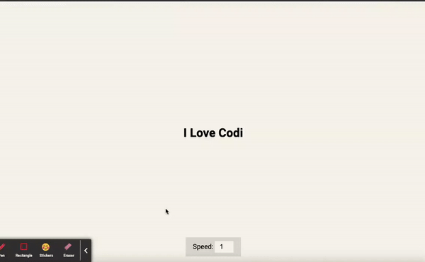

# Auto Text Effect

## Introduction

Auto Text Generation with Speed Control is a web project that allows users to see text being generated dynamically with adjustable speed. The technology uses HTML, CSS, and JavaScript to create a user-friendly interface where users can control the text generation speed from a range of 1 to 5, with 1 being slowest and 5 being the fastest.

This README provides an overview of the Auto Text Generation with Speed Control project, its features, and instructions on how to use it in your web development.

## Features

- **Automatically generate text**: on the screen at the selected speed.

- **Speed Control Panel**: Allow users to adjust the text generation speed from 1 to 5.

- **User-Friendly Interface**: A simple and intuitive interface that makes it easy for users to control the text generation speed.

- **Compatibility**: Compatible with modern web browsers, including Chrome, Firefox, Safari, and Edge.

Happy Text Generation! 🚀
